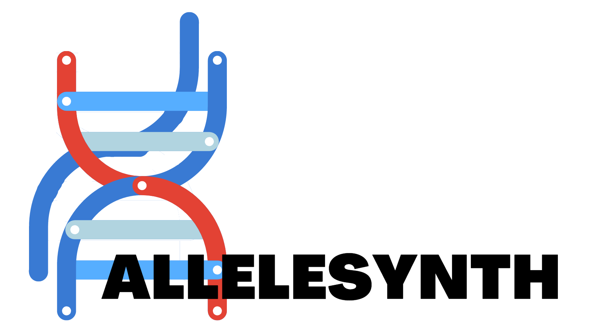
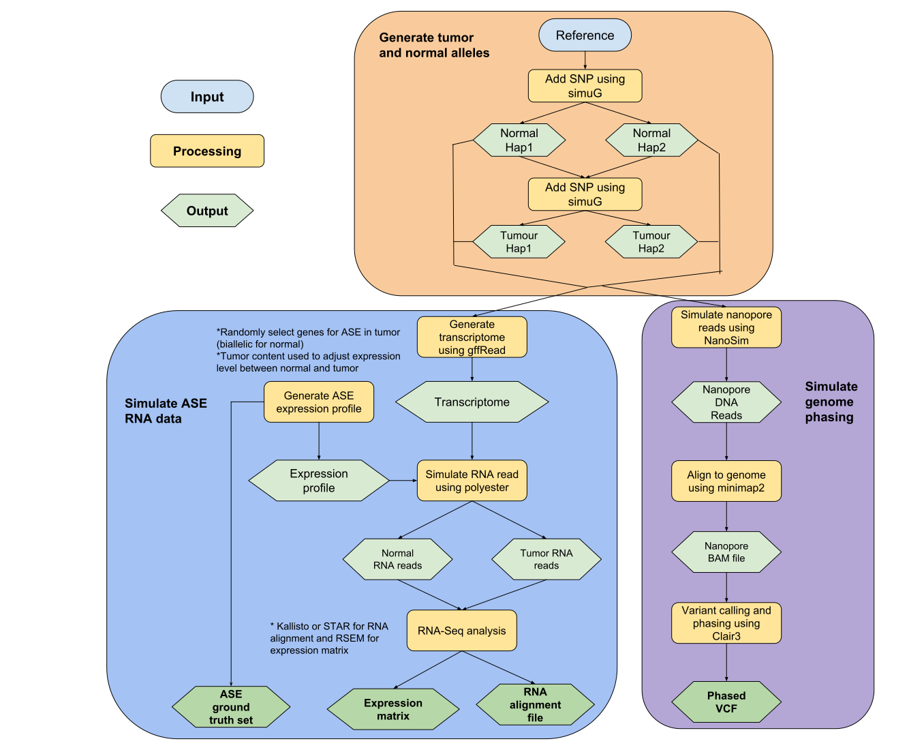

# AlleleSynth
[](https://snakemake.readthedocs.io)

This Snakemake workflow generates allele specific expression data for validation purposes. This workflow outputs RNA alignment file containing know ASE genes for a ground truth set. Additionally, a phased VCF and expression matrix is also generated. This workflow was used to validate the IMPALA software which can be found [here](https://github.com/bcgsc/IMPALA).

Table of Contents
=================

* **[Overall Workflow](#overall-workflow)**
* **[Installation](#installation)**
  * [Dependencies](#dependencies)
* **[Input Files](#input)**
* **[Output Files](#output)**
* **[Running Workflow](#running-the-workflow)**
  * [Edit config file](#edit-the-config-files)
  * [Running snakemake workflow](#running-snakemake)
* **[Contributors](#contributors)**
* **[License](#license)**

# Overall workflow


# Installation
This will clone the repository. You can run the AlleleSynth within this directory.
```
git clone https://github.com/Glenn032787/AlleleSynth.git
```
### Dependencies
> To run this workflow, you must have snakemake (v6.12.3) and singularity (v3.5.2-1.1.el7). You can install snakemake using [this guide](https://snakemake.readthedocs.io/en/stable/getting_started/installation.html) and singularity using [this guide](https://docs.sylabs.io/guides/3.5/admin-guide/installation.html). The remaining dependencies will be downloaded automatically within the snakemake workflow.

# Input
The main inputs required are the reference genome and gene annotation. Example files for hg38 chromosome 22 is included in the ref directory.  
- Reference genome 
    - Can be downloaded [here](https://ftp.ensembl.org/pub/release-109/fasta/homo_sapiens/dna/)
- GTF file 
    - Can be downloaded [here](https://hgdownload.soe.ucsc.edu/goldenPath/hg38/bigZips/genes/)

Additional gene annotation and index files is required. 
- Kalisto genome index
    - Only needed if kalisto is used instead of STAR for alignment
    - `kallisto index reference.fa`
- Picard genome index
    - Only needed if perfect phasing is done
    - `java -jar picard.jar CreateSequenceDictionary reference.fa`
- Ensembl transcript to HGNC gene 
    - Convert transcript ID to hgnc symbol
    - Ensembl100 genes are included in `ref/ensembl100_transcript2gene.tsv` 
- Gene BED file
    - Bed files for gene location
    - hg38 gene bed is included in `ref/biomart_ensembl100_GRCh38.sorted.bed.gz` 

# Output
There are four main outputs for each run. These can be found in the `output/{sampleName}/final` directory. The outputs can be used as input for the IMPALA workflow. 
1. RNA alignment file
2. Expression matrix
3. Phased VCF
4. List of genes expressed and ASE/BAE status

# Running the workflow
## Edit the config files
There are two config files that needs to be edited before running the workflow. Both config files are found in the `config` directory. 

### Example params.yaml
The `config/params.yaml` file is used to specify parameters for the simulated data. 
```
# Number of snps in each allele for normal and tumor genome
snps:
    normalSNPcount: 2500000 
    tumorSNPcount: 20000 #20000 # 1000 

# Number of ASE genes
numASE: 500

# Proportion of tumor vs normal RNA reads
tumorContent:  0.75 

# Parameters for RNA simulation
rnaReads:
    readLength: 150
    percentExpressed: 0.4 # Proportion of genes expressed
    depth: 5 # Control gene expression
    ASEfoldchange: 2 # Difference in expression between alleles for ASE 

# Simulates long read for phasing (takes much longer), else use perfect phasing (Every SNP is phased)
simulatePhasing: FALSE 

# If true, uses WASP filtering star alignment
# If false, uses kalisto alignment
WASPfilter: TRUE 

# Parameter for nanopore simulation
longRead:
    numReads: 3000000 
```

### Example refPaths.yaml
The `config/refPaths.yaml` file is used to specify paths to the input files. Places to download or generate these files are listed in [input](#input)

```
ref_genome:
    "ref/chr22.fa"

nanosim_model:
    "ref/nanosimModel/human_NA12878_DNA_FAB49712_guppy"

annotation_gtf:
    "ref/chr22.gtf"

gene_annotation:
    "ref/biomart_ensembl100_GRCh38.sorted.bed.gz"

ensembl2hgnc:
    "ref/ensembl100_transcript2gene.tsv"

kalliso_index:
    "/path/to/kalliso/index" 

chrom_length:
    "/path/to/chrom/length" 

picardIndex:
    "/path/to/picard/index" 
```

# Running snakemake
This is the command to run it with singularity. The -c parameter can be used to specify maximum number of threads. The -B parameter is used to speceify paths for the docker container to bind. The sample parameter specifies the sample name, listing multiple sample name will generate multiple sets of ASE data. 

```
snakemake -c 30 --use-singularity --singularity-args "-B /projects,/home,/gsc" --config sample=["sampleName1", "sampleName2"]
```
# Contributors
The pipeline was originnally written by [Glenn Chang](https://github.com/Glenn032787/) with the help and input from:

- Members of the Jones lab (Canada's Michael Smith Genome Sciences Centre, Vancouver, Canada).
- Special thanks to Steven Jones, Kieran O'Niell, Vannessa Porter and Luka Cuilibrk

<a href="https://github.com/Glenn032787/AlleleSynth/graphs/contributors">
  
</a>

# License 
`AlleleSynth` is licensed under the terms of the [GNU GPL v3](LICENSE).

[](https://www.gnu.org/licenses/gpl-3.0)

